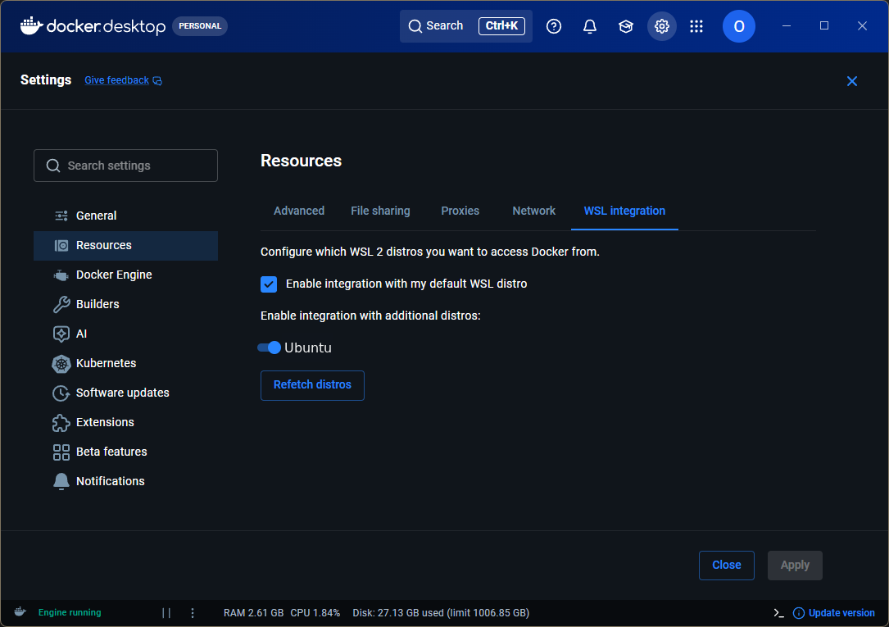
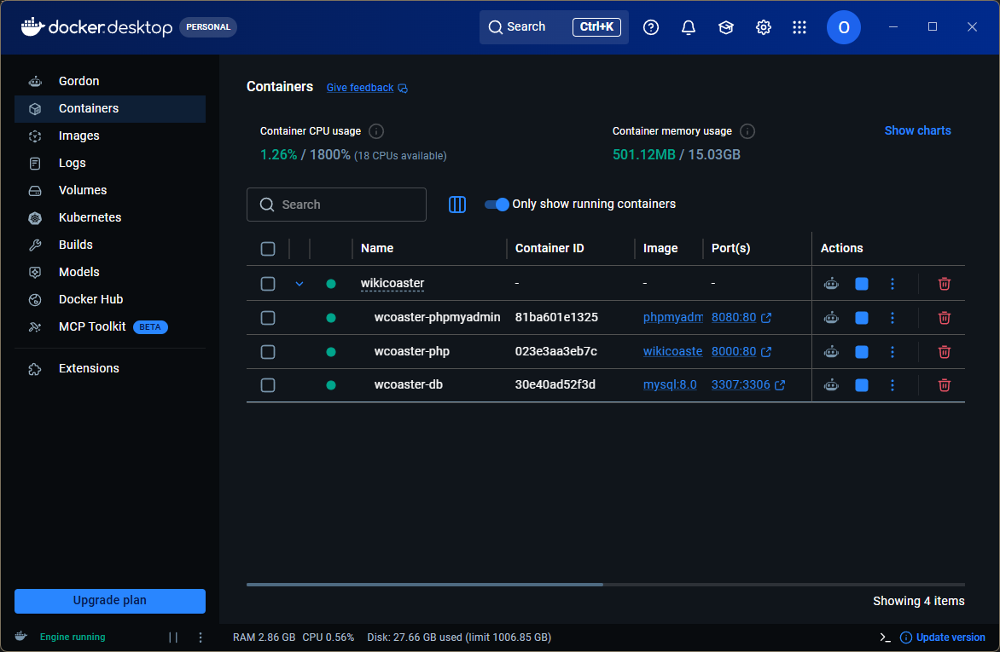
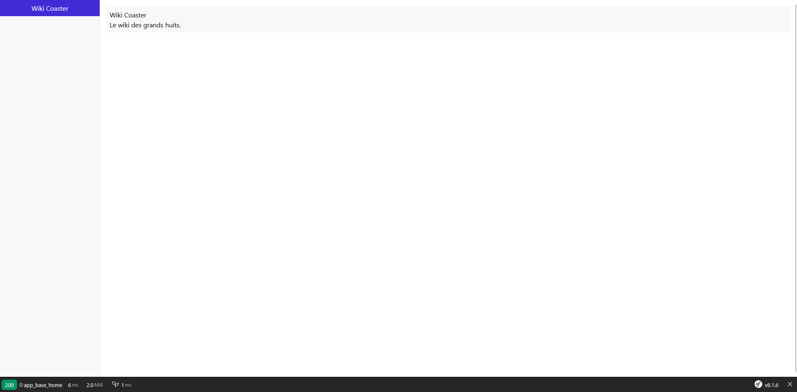

# Installation sous Windows via WSL

Ce guide explique comment préparer un environnement **WSL (Windows Subsystem
for Linux)** sur Windows afin d'installer le projet WikiCoaster avec Docker.
Toutes les commandes sont à exécuter dans un terminal, dans l'ordre indiqué.

## 1. Installer WSL

**WSL** permet d'exécuter un système Linux (Ubuntu, par exemple) directement
depuis Windows, sans machine virtuelle séparée. C'est dans ce Linux que Docker
et le projet seront installés.

### 1.1 Vérifier si WSL est déjà installé

Ouvrez **PowerShell** (clic droit sur le menu Démarrer, puis
**Terminal Windows** ou **PowerShell**) et exécutez :

```powershell
wsl --list --verbose
```

- Si la commande affiche une liste de distributions (par exemple `Ubuntu`),
  WSL est déjà installé : passez à l'étape [1.3](#13-vérifier-la-distribution).
- Si la commande indique qu'aucune distribution n'est installée, ou que la
  commande `wsl` est introuvable, passez à l'étape suivante.

### 1.2 Installer WSL et une distribution Ubuntu

Toujours dans PowerShell, exécutez :

```powershell
wsl --install -d Ubuntu
```

Cette commande installe WSL (si nécessaire) ainsi qu'une distribution
**Ubuntu**. Un redémarrage de l'ordinateur peut être demandé : dans ce cas,
redémarrez puis relancez la commande si l'installation n'est pas terminée.

À la première ouverture d'Ubuntu, un nom d'utilisateur et un mot de passe
Linux vous seront demandés. Ils servent uniquement à l'intérieur de WSL et
peuvent être différents de vos identifiants Windows. Notez-les, ils seront
nécessaires plus tard (par exemple avec `sudo`).

### 1.3 Vérifier la distribution

Relancez la commande suivante dans PowerShell pour confirmer qu'Ubuntu est
bien installé et actif :

```powershell
wsl --list --verbose
```

La colonne `STATE` doit indiquer `Running` ou `Stopped` pour `Ubuntu`, et la
colonne `VERSION` doit être `2`.

## 2. Ouvrir un terminal Ubuntu

Ouvrez le menu Démarrer de Windows, tapez `Ubuntu` et lancez l'application.
Un terminal Linux s'ouvre : toutes les commandes suivantes sont à exécuter
dans **ce terminal Ubuntu**, et non plus dans PowerShell.

## 3. Installer VS Code et l'extension WSL

Installez [Visual Studio Code](https://code.visualstudio.com/) sous Windows.
Dans VS Code, installez ensuite l'extension **WSL** de Microsoft
(`ms-vscode-remote.remote-wsl`). Cette extension permet à VS Code d'ouvrir les
fichiers et d'exécuter les outils directement dans Ubuntu, au lieu de les
ouvrir comme de simples fichiers Windows. L'ouverture du projet sera effectuée
après son clonage, à l'étape suivante.

## 4. Se placer dans le dossier personnel

Une fois dans le terminal Ubuntu, placez-vous dans votre dossier personnel
Linux (`home/<votre_utilisateur>`) :

```bash
cd ~
pwd
```

La commande `cd ~` déplace le terminal vers le dossier personnel de
l'utilisateur Linux, et `pwd` affiche le chemin actuel pour vérifier que vous
vous trouvez bien dans un dossier du type `/home/<votre_utilisateur>`.

> Travaillez toujours dans ce dossier Linux (`/home/...`) et non dans un
> dossier Windows monté (`/mnt/c/...`) : les performances de Docker et de
> Symfony y sont nettement meilleures.

## 5. Cloner le dépôt du projet

Installez Git si besoin, puis clonez le dépôt WikiCoaster :

```bash
sudo apt update
sudo apt install -y git
git clone https://github.com/Oviglo/WikiCoaster.git
cd WikiCoaster
```

- `sudo apt update` puis `sudo apt install -y git` installent Git sur Ubuntu.
- `git clone` télécharge le dépôt et crée un dossier `WikiCoaster`.
- `cd WikiCoaster` entre dans ce dossier : les commandes suivantes doivent y
  être exécutées.

### Si vous avez déjà votre propre dépôt GitHub

Si vous avez déjà créé votre dépôt GitHub pour ce projet, clonez directement
ce dépôt à la place de `Oviglo/WikiCoaster`. Remplacez l'URL dans la commande
suivante par l'adresse de votre dépôt :

```bash
git clone https://github.com/VOTRE_NOM/WikiCoaster.git
cd WikiCoaster
```

Dans ce cas, votre dépôt est déjà configuré comme `origin` : ne réalisez pas
l'étape **« Remplacer le dépôt distant par le vôtre »**.

## 6. Ouvrir le projet avec VS Code

Dans le terminal Ubuntu, toujours dans le dossier `WikiCoaster`, ouvrez le
projet avec :

```bash
code .
```

La commande `code .` ouvre le dossier courant dans VS Code avec la connexion
WSL. Vérifiez que VS Code indique **WSL: Ubuntu** dans sa barre d'état.

> [!NOTE]
> Si Git affiche un message indiquant que le dépôt n'est pas sûr (*dubious
> ownership*) lorsque vous ouvrez le projet depuis Windows, ajoutez le dossier
> WSL aux dossiers approuvés dans votre fichier Git `~/.gitconfig` sous
> Windows. Ajoutez ou complétez cette section en adaptant `loic` avec votre nom
> d'utilisateur Ubuntu :
>
> ```ini
> [safe]
>     directory = \\wsl$\Ubuntu\home\loic\WikiCoaster
> ```
>
> Enregistrez le fichier puis relancez VS Code. Cette configuration indique à
> Git que ce dépôt WSL est fiable.

### Corriger un problème de droits d'écriture

Les commandes exécutées dans un conteneur Docker peuvent créer des fichiers
appartenant à `root`. Dans ce cas, VS Code peut afficher un message indiquant
qu'il ne peut pas modifier ou enregistrer un fichier.

Depuis le terminal Ubuntu, arrêtez d'abord les conteneurs si nécessaire, puis
rendez la propriété du projet à votre utilisateur Linux :

```bash
cd ~/WikiCoaster
sudo chown -R "$USER":"$USER" .
```

- `sudo` exécute la commande avec les droits administrateur.
- `chown` change le propriétaire des fichiers.
- `-R` applique le changement à tous les fichiers et sous-dossiers.
- `"$USER":"$USER"` désigne votre utilisateur et son groupe Linux.
- `.` désigne le dossier `WikiCoaster` courant.

Fermez puis rouvrez le fichier dans VS Code après cette commande. Pour éviter
que le problème se reproduise, ouvrez toujours le projet depuis Ubuntu avec
`code .` et exécutez les commandes Docker depuis WSL.

## 7. Remplacer le dépôt distant par le vôtre

Créez d'abord un dépôt sur [github.com](https://github.com/) avec votre propre
compte, par exemple nommé `WikiCoaster`.

Dans le terminal, toujours dans le dossier `WikiCoaster`, remplacez
`VOTRE_NOM` par votre nom d'utilisateur GitHub :

```bash
git remote remove origin
git remote add origin https://github.com/VOTRE_NOM/WikiCoaster.git
git remote -v
git push -u origin main
```

- `git remote remove origin` supprime le lien vers le dépôt d'origine
  `Oviglo/WikiCoaster`.
- `git remote add origin ...` ajoute le lien vers votre dépôt GitHub et lui
  donne le nom `origin`.
- `git remote -v` affiche les adresses enregistrées, pour vérifier que le lien
  pointe bien vers votre dépôt.
- `git push -u origin main` envoie le code cloné vers votre dépôt GitHub et
  associe la branche locale `main` à la branche distante `origin/main`.

Si Git indique que votre branche s'appelle `master` au lieu de `main`,
utilisez `git push -u origin master`. GitHub peut demander une authentification
lors du premier envoi.

## Configurer Docker Desktop pour WSL

Installez et démarrez [Docker Desktop](https://www.docker.com/products/docker-desktop/)
sur Windows. Docker Desktop doit être configuré pour utiliser votre
distribution Ubuntu installée avec WSL.

1. Ouvrez **Docker Desktop**.
2. Ouvrez **Settings** (l'icône en forme d'engrenage).
3. Dans **Resources**, ouvrez l'onglet **WSL Integration**.
4. Activez **Enable integration with my default WSL distro**.
5. Activez également l'intégration pour la distribution **Ubuntu** si elle est
  affichée dans la liste.
6. Cliquez sur **Apply & Restart** pour appliquer la configuration.

La configuration doit ressembler à l'exemple suivant :



## Construire et démarrer les conteneurs

Dans le terminal Ubuntu de WSL, vérifiez que vous êtes bien dans le dossier
`WikiCoaster`, celui qui contient le fichier `compose.yaml` :

```bash
cd ~/WikiCoaster
pwd
ls compose.yaml
```

La commande `pwd` doit afficher un chemin se terminant par
`/home/<votre_utilisateur>/WikiCoaster`, et la commande `ls compose.yaml` doit
afficher le fichier. Si ce n'est pas le cas, déplacez-vous dans le bon dossier
avant de continuer.

Lancez ensuite la construction des images et le démarrage des conteneurs :

```bash
docker-compose up -d --build
```

- `docker-compose` utilise le fichier `compose.yaml` du dossier courant.
- `up` crée et démarre les conteneurs du projet.
- `-d` laisse les conteneurs fonctionner en arrière-plan.
- `--build` construit ou reconstruit les images Docker avant le démarrage.

Cette commande doit impérativement être exécutée depuis le dossier
`WikiCoaster`.

## Installer les dépendances dans le conteneur PHP

Depuis le terminal Ubuntu de WSL, ouvrez un terminal à l'intérieur du
conteneur PHP :

```bash
docker exec -it wcoaster-php bash
```

La commande `docker exec` exécute une commande dans un conteneur déjà démarré.
Les options `-it` permettent d'utiliser ce terminal de manière interactive, et
`wcoaster-php` désigne le conteneur de l'application. L'argument `bash` ouvre
une console Linux à l'intérieur du conteneur.

Une fois dans le terminal du conteneur, exécutez les commandes suivantes :

```bash
composer install
npm install
npm run dev
mkdir var
chmod 777 var
```

- `composer install` installe les dépendances PHP du projet définies dans
  `composer.json`.
- `npm install` installe les dépendances JavaScript définies dans
  `package.json`.
- `npm run dev` construit les fichiers frontend nécessaires au développement.
- `mkdir var` crée le dossier `var` utilisé par Symfony pour ses fichiers
  temporaires, son cache et ses journaux.
- `chmod 777 var` donne les droits de lecture, d'écriture et d'exécution à
  tous les utilisateurs sur ce dossier, afin que Symfony puisse y écrire.

Pour quitter le terminal du conteneur et revenir au terminal Ubuntu, exécutez :

```bash
exit
```

## Vérifier les conteneurs et ouvrir l'application

Ouvrez **Docker Desktop**, puis sélectionnez **Containers** dans le menu de
gauche. Les conteneurs `wcoaster-php`, `wcoaster-db` et
`wcoaster-phpmyadmin` doivent être démarrés. Leur statut doit apparaître comme
actif dans Docker Desktop.

La liste doit ressembler à l'exemple suivant :



Dans la ligne du conteneur `wcoaster-php`, cliquez sur le lien du port
`8000`. Docker Desktop ouvre alors l'application dans votre navigateur.

Vous pouvez également ouvrir directement l'adresse suivante dans un
navigateur :

```text
http://localhost:8000
```

La page d'accueil de WikiCoaster doit s'afficher :


